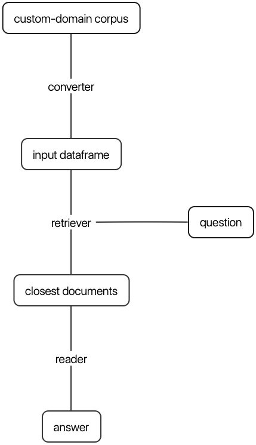

# cdQA: Closed Domain Question Answering

[](https://travis-ci.com/fmikaelian/cdQA)
[](https://codecov.io/gh/fmikaelian/cdQA)
[](https://pypi.org/project/cdqa/)
[](https://pypi.org/project/cdqa/)
[]()
[]()
[](.github/CODE_OF_CONDUCT.md)
[](http://makeapullrequest.com)
[](https://choosealicense.com/licenses/mit/)

An end-to-end closed-domain question answering system with BERT and classic IR methods 📚

- [Installation](#installation)
  - [With pip](#with-pip)
  - [From source](#from-source)
  - [Hardware Requirements](#hardware-requirements)
- [Getting started](#getting-started)
  - [How it works](#how-it-works)
  - [Preparing your data](#preparing-your-data)
  - [Training models](#training-models)
  - [Making predictions](#making-predictions)
  - [Evaluating models](#evaluating-models)
  - [Practical examples](#practical-examples)
- [Deployment](#deployment)
  - [Manual](#manual)
  - [With docker](#with-docker)
- [Contributing](#contributing)
- [References](#references)

## Installation

### With pip

```shell
pip install cdqa
```

### From source

```shell
git clone https://github.com/fmikaelian/cdQA.git
cd cdQA
pip install -e .
```

### Hardware Requirements

Experiments have been done on an AWS EC2 `p3.2xlarge` Deep Learning AMI (Ubuntu) Version 22.0 + a single Tesla V100 16GB.

## Getting started

### How it works



### Preparing your data

To use `cdqa` you need a `.csv` corpus file with the following columns:

| title             | paragraphs                                       |
| ----------------- | ------------------------------------------------ |
| The Article Title | [Paragraph 1 of Article, Paragraph N of Article] |

You can use the converters to create this file:

```python
# create a corpus dataframe from a directory containing .pdf files
```

### Training models

Read your corpus in `.csv` format:

```python
import pandas as pd
from cdqa.pipeline.cdqa_sklearn import QAPipeline

df = pd.read_csv('your-custom-corpus-here.csv')
```

Fit the pipeline on your corpus using the pre-trained reader:

```python
cdqa_pipeline = QAPipeline(model='bert_qa_vCPU-sklearn.joblib')
cdqa_pipeline.fit(X=df)
```

If you want to fine-tune the reader on your custom SQuAD-like annotated dataset:

```python
cdqa_pipeline = QAPipeline()
cdqa_pipeline.fit_reader('path-to-custom-squad-like-dataset.json')
```

### Making predictions

To get the best prediction given an input query:

```python
query = 'your question here'
cdqa_pipeline.predict(X=query)
```

### Evaluating models

In order to evaluate models on your custom dataset you will need to annotate it. The annotation process can be done in 3 steps:

1. Convert your pandas DataFrame into a json file with SQuAD format:

    ```python
    from cdqa.utils.converter import df2squad

    json_data = df2squad(df=df, squad_version='v2.0', output_dir='data', filename='bnpp_newsroom-v1.1')
    ```

2. Use an annotator to add ground truth question-answer pairs:

    Please refer to our [`cdQA-annotator`](https://github.com/fmikaelian/cdQA-annotator), a web-based annotator for closed-domain question answering datasets with SQuAD format.

3. Evaluate the reader:

    ```python
    from cdqa.utils.evaluation import evaluate_reader

    evaluate_reader(dataset_file='path-to-annotated-dataset.json', prediction_file='predictions.json')
    ```

4. Evaluate a whole pipeline object:

    ```python
    from cdqa.utils.evaluation import evaluate_pipeline

    evaluate_pipeline(cdqa_pipeline, 'path-to-annotated-dataset.json')

    ```

### Practical examples

- [First steps with cdQA (notebook)](examples/tutorial-predict-pipeline.ipynb).
- [Training the reader on SQuAD (script)](examples/tutorial-train-reader-squad.py)

## Deployment

### Manual

You can deploy a `cdQA` REST API by executing:

```shell
FLASK_APP=api.py flask run -h 0.0.0.0
```

You can now make requests to test your API (here using [HTTPie](https://httpie.org/)):

```shell
http localhost:5000/api query=='your question here'
```

If you wish to serve a user interface on top of your `cdQA` system, follow the instructions of [cdQA-ui](https://github.com/fmikaelian/cdQA-ui), a web interface developed for `cdQA`.

### With docker

You can use the [Dockerfile](Dockerfile) to deploy the full `cdQA` app.

## Contributing

Read our [Contributing Guidelines](.github/CONTRIBUTING.md).

## References

| Type                 | Title                                                                                                                                        | Author                                                                                                                                                                                                                                                                             | Year |
| -------------------- | -------------------------------------------------------------------------------------------------------------------------------------------- | ---------------------------------------------------------------------------------------------------------------------------------------------------------------------------------------------------------------------------------------------------------------------------------- | ---- |
| :video_camera: Video | [Stanford CS224N: NLP with Deep Learning Lecture 10 – Question Answering](https://youtube.com/watch?v=yIdF-17HwSk)                           | Christopher Manning                                                                                                                                                                                                                                                                | 2019 |
| :newspaper: Paper    | [Reading Wikipedia to Answer Open-Domain Questions](https://arxiv.org/abs/1704.00051)                                                        | Danqi Chen, Adam Fisch, Jason Weston, Antoine Bordes                                                                                                                                                                                                                               | 2017 |
| :newspaper: Paper    | [Neural Reading Comprehension and Beyond](https://cs.stanford.edu/people/danqi/papers/thesis.pdf)                                            | Danqi Chen                                                                                                                                                                                                                                                                         | 2018 |
| :newspaper: Paper    | [BERT: Pre-training of Deep Bidirectional Transformers for Language Understanding](https://arxiv.org/abs/1810.04805)                         | Jacob Devlin, Ming-Wei Chang, Kenton Lee, Kristina Toutanova                                                                                                                                                                                                                       | 2018 |
| :newspaper: Paper    | [Contextual Word Representations: A Contextual Introduction](https://arxiv.org/abs/1902.06006)                                               | Noah A. Smith                                                                                                                                                                                                                                                                      | 2019 |
| :newspaper: Paper    | [End-to-End Open-Domain Question Answering with BERTserini](https://arxiv.org/abs/1902.01718)                                                | Wei Yang, Yuqing Xie, Aileen Lin, Xingyu Li, Luchen Tan, Kun Xiong, Ming Li, Jimmy Lin                                                                                                                                                                                             | 2019 |
| :newspaper: Paper    | [Data Augmentation for BERT Fine-Tuning in Open-Domain Question Answering](https://arxiv.org/abs/1904.06652)                                 | Wei Yang, Yuqing Xie, Luchen Tan, Kun Xiong, Ming Li, Jimmy Lin                                                                                                                                                                                                                    | 2019 |
| :newspaper: Paper    | [Passage Re-ranking with BERT](https://arxiv.org/abs/1901.04085)                                                                             | Rodrigo Nogueira, Kyunghyun Cho                                                                                                                                                                                                                                                    | 2019 |
| :newspaper: Paper    | [MRQA: Machine Reading for Question Answering](https://mrqa.github.io/)                                                                      | Jonathan Berant, Percy Liang, Luke Zettlemoyer                                                                                                                                                                                                                                     | 2019 |
| :newspaper: Paper    | [Unsupervised Question Answering by Cloze Translation](https://arxiv.org/abs/1906.04980)                                                     | Patrick Lewis, Ludovic Denoyer, Sebastian Riedel                                                                                                                                                                                                                                   | 2019 |
| :computer: Framework | [Scikit-learn: Machine Learning in Python](http://jmlr.csail.mit.edu/papers/v12/pedregosa11a.html)                                           | Fabian Pedregosa, Gaël Varoquaux, Alexandre Gramfort, Vincent Michel, Bertrand Thirion, Olivier Grisel, Mathieu Blondel, Peter Prettenhofer, Ron Weiss, Vincent Dubourg, Jake Vanderplas, Alexandre Passos, David Cournapeau, Matthieu Brucher, Matthieu Perrot, Édouard Duchesnay | 2011 |
| :computer: Framework | [PyTorch](https://arxiv.org/abs/1906.04980)                                                                                                  | Adam Paszke, Sam Gross, Soumith Chintala, Gregory Chanan                                                                                                                                                                                                                           | 2016 |
| :computer: Framework | [PyTorch Pretrained BERT: The Big & Extending Repository of pretrained Transformers](https://github.com/huggingface/pytorch-pretrained-BERT) | Hugging Face                                                                                                                                                                                                                                                                       | 2018 |
